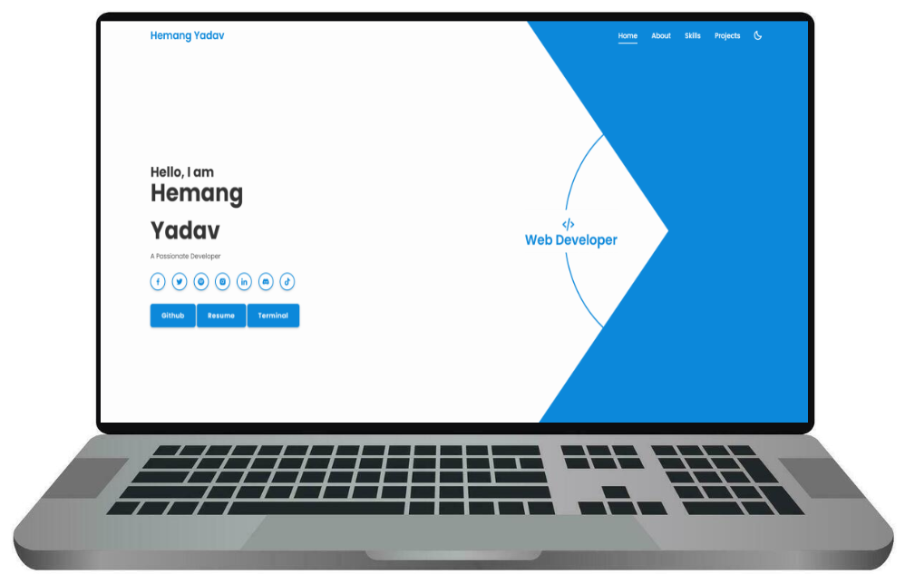

<p align = "center">


</p>

<h1 align = "center">

zemerik.github.io - [Website](https://zemerik.is-a.dev)

</h1>

<div align = "center">


</div>

<p align = "center">
  
</p>

## ❓ How to Contribute?

- All Contributions are highly appreciated, if you would like to contribute to this project, follow the steps below. 

1. Fork a copy of this Repository on your Github account by clicking below,

- [Fork](https://github.com/Zemerik/zemerik.github.io/fork)

2. Clone your Forked Repository by using the following `GIT` command:

```bash
git clone https://github.com/[YOUR GITHUB USERNAME]/zemerik.github.io
```

3. Navigate into the Project's `Directory` by using the command below:

```bash
cd zemerik.github.io
```

4. Initialize a Remote to the original Repository by the following `GIT` command:

```bash
git remote add upstream https://github.com/Zemerik/zemerik.github.io
```

5. Create a new `branch` in which you can make your desired changes:

```bash
git checkout -b newcontribution
```

6. After making your changes, add all your files to the Staging Area:

```bash
git add --all
```

7. Commit your Changes:

```bash
git commit -m "[COMMIT MSG]"
```

> [!Note]
> Remember to live a good commit message

8. Push all your Changes:

```bash
git push origin newcontribution
```

9. Create a new Pull - Request (PR) on the Original Repository

> Your Pull Request will be merged / reviewed as soon as possible. 

## 🐞Bug/Issue/Feedback/Feature Request:

- If you would like to report a bug, a issue, implement any feedack, or request any feature, you are free to do so by opening a issue on this repository. Remember to give a detailed explanation of what you are trying to say, and how it will help the website. 

## 💁 Support:

For any kind of support or inforrmation, you are free to join our **Discord Server**,

<a href = "https://discord.gg/UF9KsmuGbr">
  
</a>

<h1 align = "center">
  Thanks for Visiting🙏
</h1>

<p align = "center">
  Don't forget to leave a ⭐
  <br>
  Made with 💖 by <a href = "https://github.com/Zemerik">Hemang Yadav (Zemerik)</a>
</p>
