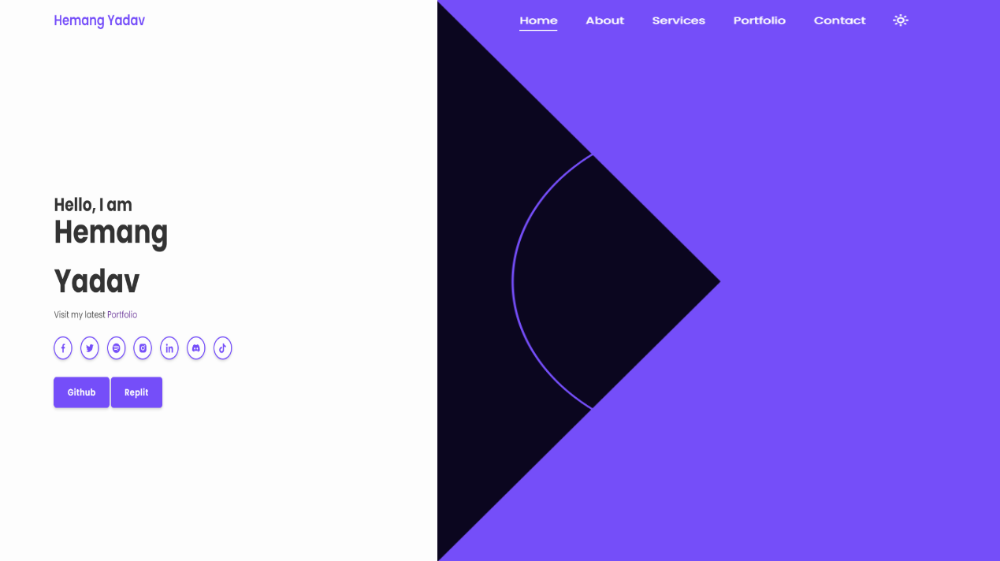

<h1 align = "center">
  
  WELCOME TO MY [PORTFOLIO](https://zemerik.is-a.dev/)

</h1>

<div align = "center">

  [zemerik.is-a.dev](https://zemerik.is-a.dev)

</div>

<div align = "center">




</div>

> [!NOTE]
> This is not the latest version of my portfolio. You can see the live demo of that portfolio [here](https://zemerik.vercel.app) and view the Repository [here](https://github.com/Zemerik/Portfolio-v2).

## About:

This is the source code for the previous version of my portfolio and my website, zemerik.is-a.dev. It was developed using JavaScript, CSS, and HTML. The project showcases my skills in web development. It serves as a testament to my ability to create functional and visually appealing websites.

## FEATURES:

🎩 Responsive Navbar with Icons and hover effects

🤯 Light and Dark Mode

⚡ CSS effects such as Animation, Transition and Hover for different sections. 

🏆 Appealing Icons for different Links

## USAGE:

- Use GIT to store the files of this Repository on your machine:

```
git clone https://github.com/Zemerik/zemerik.github.io
```

- You can now customise the portfolio as you like. 

> [!Caution]
> Use or Distribution of any private information such as Images, Name, Information, CNAME, etc is not permitted. 


<h1 align = "center">
  Thanks for Visiting🙏
</h1>

<p align = "center">
  Don't forget to leave a ⭐
  <br>
  Made with 💖 by <a href = "https://github.com/Zemerik">Hemang Yadav (Zemerik)</a>
</p>
