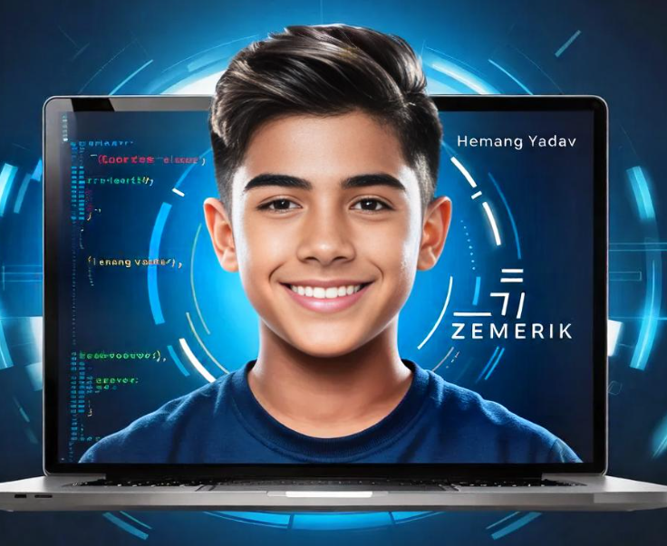
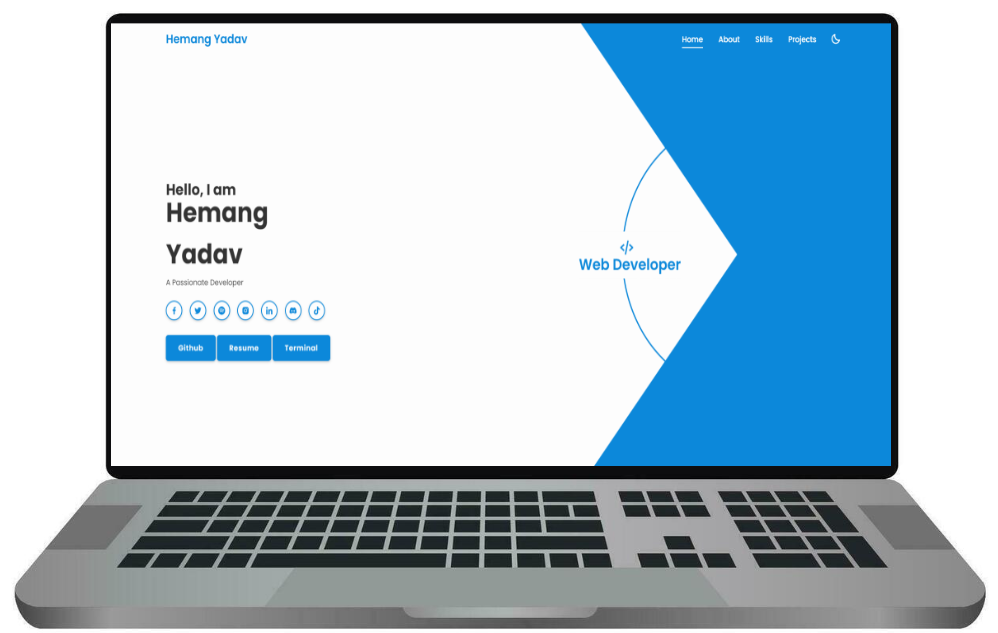
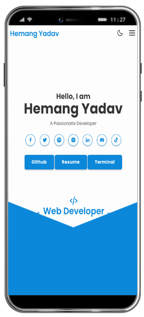

<p align = "center">



</p>

<h1 align = "center">

zemerik.github.io - [Website](https://zemerik.is-a.dev)

</h1>

<div align = "center">


</div>

<p align = "center">
  
</p>

## About:

This is the source code for the previous version of my portfolio and my website, zemerik.is-a.dev. It was developed using JavaScript, CSS, and HTML. The project showcases my skills in web development. It serves as a testament to my ability to create functional and visually appealing websites.

> - View my Website [here](https://zemerik.is-a.dev)

## FEATURES:


<table align = "center">
  <tr>
    <td>
      🎩 Responsive Navbar with Icons and hover effects
      <br>
      <br>
      🤯 Light & Dark Mode
      <br>
      <br>
      ⚡ CSS effects such as Animation, Transition and Hover for different sections.
      <br>
      <br>
        🏆 Appealing Icons for different Links
    </td>
    <td>

  
    </td>
  </tr>
</table>


## USAGE:

- Use GIT to store the files of this Repository on your machine:

```
git clone https://github.com/Zemerik/zemerik.github.io
```

- You can now customise the portfolio as you like. 

> [!Caution]
> Use or Distribution of any private information such as Images, Name, Information, CNAME, etc is not permitted. 

## CONTRIBUTING:

Contributions are always welcome and appreciated. Feel free to create an Issue or Pull - Request for any fixes, bug reports, feature request or more. 

<h1 align = "center">
  Thanks for Visiting🙏
</h1>

<p align = "center">
  Don't forget to leave a ⭐
  <br>
  Made with 💖 by <a href = "https://github.com/Zemerik">Hemang Yadav (Zemerik)</a>
</p>
